<p align="center">
  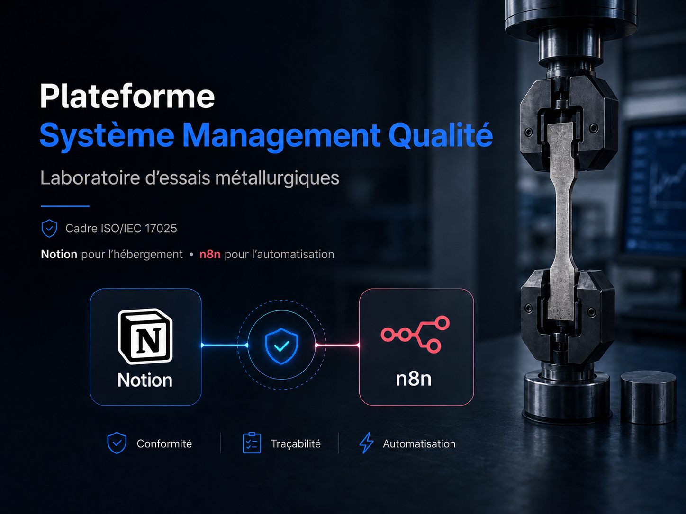
</p>

# notion-qms-platform
## Plateforme de Système de Management de la Qualité (SMQ) — Notion × n8n pour laboratoire industriel accrédité ISO/IEC 17025


## Présentation en une phrase

Architecture documentée d'une plateforme de Système de Management de la Qualité (SMQ) combinant Notion (référentiel relationnel, RACI) et n8n (automatisation événementielle et planifiée) pour une PME de laboratoire métallurgique évoluant dans un environnement normatif rigoureux (ISO/IEC 17025).

> 🎥 **Voir le projet en action** — ▶ [Présentation générale](https://youtu.be/8AHTXgseMW4) · [Focus](https://youtu.be/NJMF1m_C7qQ) · [RH / Formation](https://youtu.be/NXGGmjdkIiE) · [Documentation](https://youtu.be/EjH6szkbJ3w) · [Achats](https://youtu.be/TiAE6TcnOb0)

## Le problème

Une PME de laboratoire accréditée (~15-20 personnes, essais destructifs et contrôles non destructifs) doit produire des preuves continues sans le budget ni la complexité d'un progiciel de gestion intégré. Les outils bureautiques classiques génèrent :

- des **silos** d'information dispersée entre courriels, Excel et dossiers partagés ;
- des **oublis** sur les tâches récurrentes critiques pour l'accréditation (étalonnages, certificats, audits) ;
- un **bus factor** élevé : la mémoire des processus dépend d'une personne-clé ;
- une **charge administrative** croissante, sans capacité d'analyse consolidée.

## La solution

Une plateforme hybride orientée Système de Management de la Qualité (SMQ), pensée pour rester maintenable par une petite structure :

- **Notion** comme référentiel structuré — 9 hubs Back End, matrice RACI appliquée à toutes les tâches, vues différenciées par profil (commun / gestionnaires / personnels).
- **n8n auto-hébergé (VPS Hostinger)** comme moteur d'automatisation — scans planifiés (production de tâches) et webhooks événementiels (réaction aux clics utilisateur), avec journalisation des exécutions.
- **Agents Notion AI** intégrés — une interface conversationnelle posée sur les bases, respectant les rôles.

> **Pourquoi n8n plutôt que les automatisations natives de Notion ?** En 2025-2026, Notion ne permet pas qu'une automatisation en déclenche une autre : un processus ne peut pas en appeler un autre de façon chaînée. n8n lève ce plafond — un workflow peut en déclencher d'autres — ce qui rend possible un enchaînement de processus **entièrement automatisé, de bout en bout**, sans intervention manuelle entre les étapes.

Le choix structurant : faire converger toutes les actions vers une **table de faits unique** (*Master Tâches*) et déléguer la circulation de la donnée entre domaines à n8n. Cela donne un seul cycle de vie à maintenir, une seule surface d'intégration et une traçabilité homogène.

**Ce que ce n'est pas :** ni un progiciel de gestion intégré, ni une preuve d'accréditation. Le système *contribue à* la maîtrise d'un SMQ ; il ne *garantit pas* la conformité ISO/IEC 17025.

## Investissement projet

| Période | Jours actifs | Heures investies | Rythme moyen | Taux de participation |
|---|---|---|---|---|
| 5 mois | 79 jours | 302 h | 3.8 h / jour ouvré | 64 % |

**Répartition par catégorie :** n8n — 150 h · Notion — 135 h · Documentation — 15 h · Infrastructure (Hostinger) — 4 h

## Pilotage & métriques du projet

Le projet a été piloté avec un tableau de bord de suivi dédié, alimenté tout au long du développement.

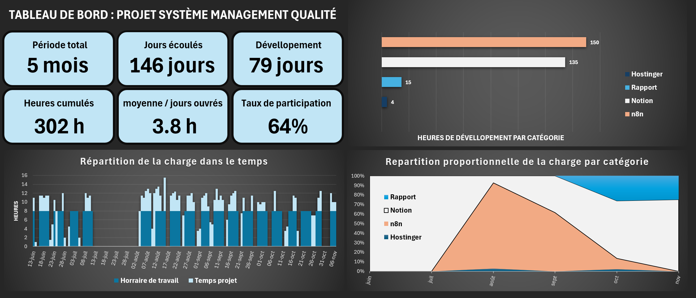
*Suivi de la charge de travail sur 5 mois : répartition hebdomadaire, taux de participation (64 %), rythme moyen (3.8 h/jour ouvré), 302 h cumulées sur 79 jours actifs.*

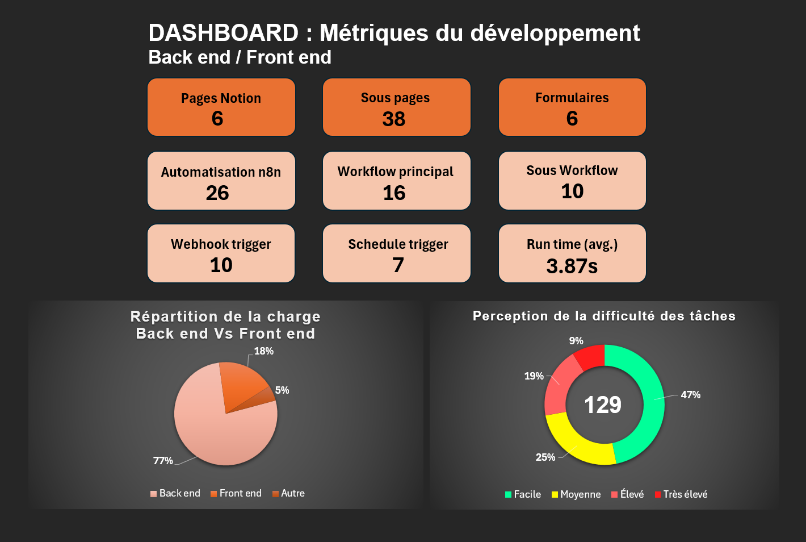
*Architecture chiffrée : 6 pages et 38 sous-pages Notion, 6 formulaires, 26 automatisations n8n (16 WF principaux, 10 sous-WF), répartition de charge Back 77 % / Front 18 %, runtime moyen des WF 3.87 s.*

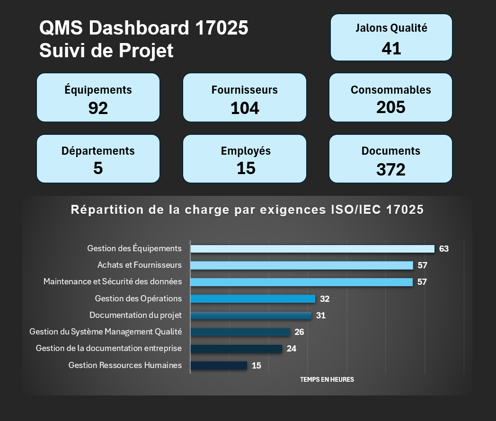
*Périmètre opérationnel : 41 jalons qualité, 92 équipements, 104 fournisseurs, 205 consommables, 5 départements, 15 employés, 372 documents — charge de développement distribuée par exigence ISO/IEC 17025.*

## Architecture

9 hubs Back End · 38 bases · 30 modules · 62 liens directionnels. *Master Tâches* est la table de faits centrale : équipements, certificats, jalons qualité, achats et formations y déposent tous une tâche RACI, exécutée selon le même cycle puis archivée par le même mécanisme.

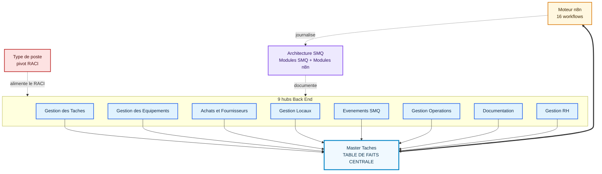

Diagramme source : [diagrams/back-end-architecture.mmd](diagrams/back-end-architecture.mmd) · détail : [docs/01-architecture-back-end.md](docs/01-architecture-back-end.md).

## Automatisation

16 workflows n8n, en trois groupes (détail : [docs/02-workflows-n8n.md](docs/02-workflows-n8n.md)) :

| # | Workflow | Groupe | Rôle |
|---|---|---|---|
| 01 | Scan parc équipements | Scans planifiés | Crée les tâches d'étalonnage / maintenance / déviation |
| 02 | Scan certificats fournisseurs | Scans planifiés | Déclenche le renouvellement des certificats |
| 03 | Scan tâches récurrentes | Scans planifiés | Génère les rituels qualité (5S, audits, revues) |
| 04 | Scan calendrier qualité | Scans planifiés | Matérialise les jalons ISO 17025 en tâches |
| 05 | Archivage Master Tâches | Scans planifiés | Décharge la base centrale (4 sous-workflows) |
| 06 | Mise à jour échéanciers | Webhooks événementiels | Recalcule l'échéance source à la clôture |
| 07 | Génération PO sur demande | Webhooks événementiels | Convertit une DA en bon de commande |
| 08 | Génération PO planifiés | Scans planifiés | Crée les PO récurrents |
| 09 | Suivi PO | Webhooks événementiels | Met à jour les statuts de commande |
| 10 | Update statut Magasin | Webhooks événementiels | Synchronise le stock à la réception |
| 11 | Mise à jour documentation | Webhooks événementiels | Versionne et archive la version précédente |
| 12 | Onboarding par type de poste | Formation / Onboarding | Génère les inscriptions obligatoires à l'embauche |
| 13 | MAJ formations sur commande | Formation / Onboarding | Maintient la cohérence instances ↔ inscriptions |
| 14 | Programmation des modules | Formation / Onboarding | Programme les modules récurrents (planifié) |
| 15 | Inscription individuelle | Formation / Onboarding | Inscrit hors session de masse |
| 16 | Tâche de formation (RACI) | Formation / Onboarding | Pousse la formation en tâche Master Tâches |

Les scans planifiés (WF 01-05) délèguent la création de tâche à des sous-workflows dédiés et journalisent chaque exécution dans une base de logs n8n.

## Agents IA

Deux agents Notion AI sont intégrés à la plateforme QMS : **Le planificateur** (suivi des tâches dans *Master Tâches*, dans le respect du RACI de l'utilisateur) et **Le bibliothécaire** (recherche et synthèse dans la documentation qualité). Détail : [docs/06-agents-ia.md](docs/06-agents-ia.md).

## 🎥 Démonstrations vidéo

Le moyen le plus rapide de voir le système réel en action — **cliquer sur une vignette ouvre la vidéo**.

[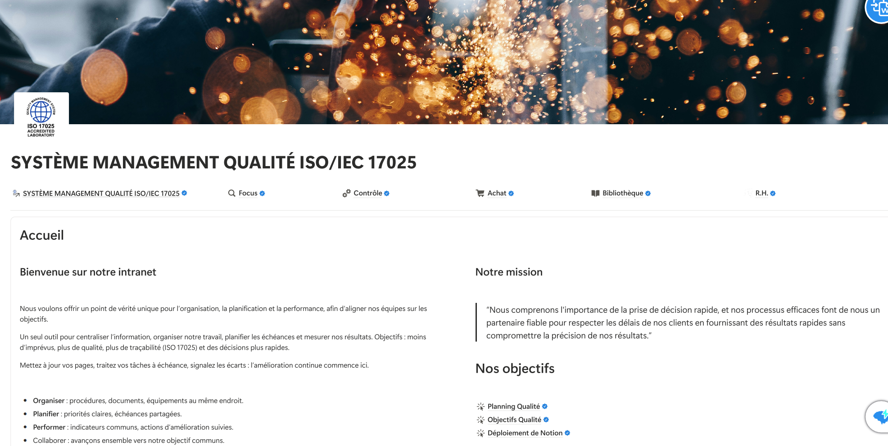](https://youtu.be/8AHTXgseMW4)

**▶ [Présentation générale](https://youtu.be/8AHTXgseMW4)** — vue d'ensemble de la plateforme : QMS, Focus, Contrôle, Achats, Bibliothèque, RH.

<table>
  <tr>
    <td width="50%" align="center"><a href="https://youtu.be/NJMF1m_C7qQ">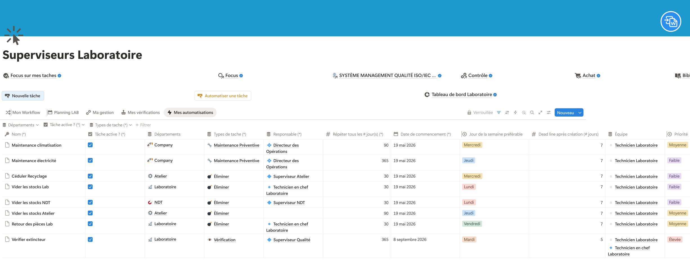</a></td>
    <td width="50%" align="center"><a href="https://youtu.be/NXGGmjdkIiE">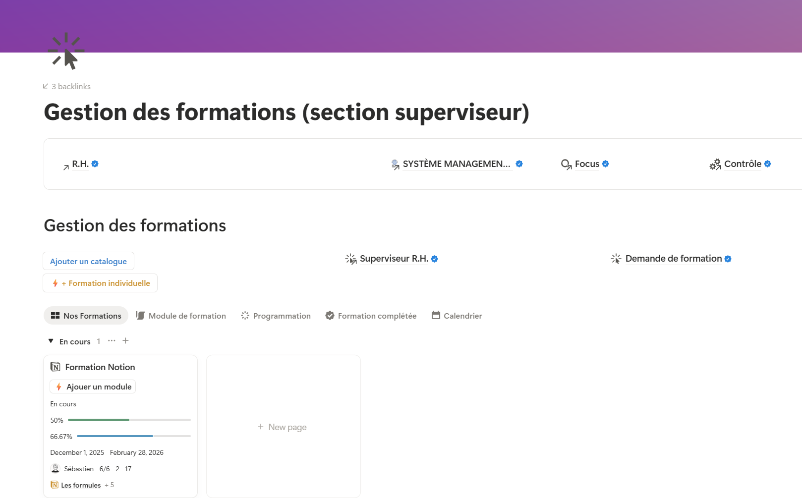</a></td>
  </tr>
  <tr>
    <td align="center"><b>▶ <a href="https://youtu.be/NJMF1m_C7qQ">Module Focus — tâches &amp; agent IA</a></b><br/>Demandes et actions transformées en tâches suivies, avec un agent IA respectant les rôles.</td>
    <td align="center"><b>▶ <a href="https://youtu.be/NXGGmjdkIiE">Module RH / Formation — n8n</a></b><br/>Un bouton Notion déclenche un workflow n8n qui crée les instances et inscrit les employés.</td>
  </tr>
  <tr>
    <td width="50%" align="center"><a href="https://youtu.be/EjH6szkbJ3w">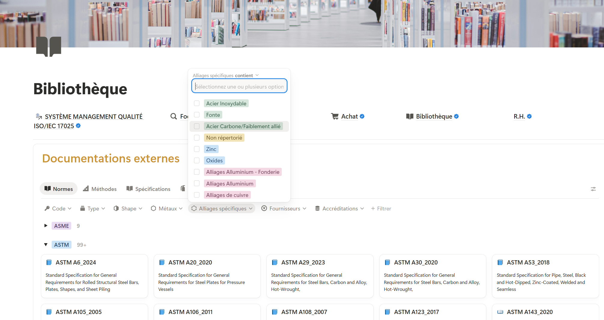</a></td>
    <td width="50%" align="center"><a href="https://youtu.be/TiAE6TcnOb0">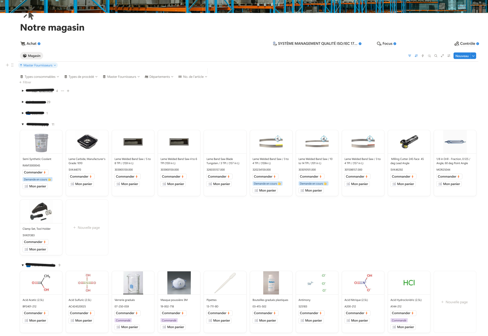</a></td>
  </tr>
  <tr>
    <td align="center"><b>▶ <a href="https://youtu.be/EjH6szkbJ3w">Module Documentation / Bibliothèque</a></b><br/>Bibliothèque centralisée et filtrable, accès rapide à la bonne version + IA documentaire.</td>
    <td align="center"><b>▶ <a href="https://youtu.be/TiAE6TcnOb0">Module Achats — magasin &amp; cycle PO</a></b><br/>Du panier à la réception : regroupement par fournisseur, génération et suivi des PO.</td>
  </tr>
</table>

## Captures d'écran

Six vues représentatives (inventaire complet et anonymisation : [screenshots/MANIFEST.md](screenshots/MANIFEST.md)) :

<table>
  <tr>
    <td width="50%" align="center"><b>Front End — accueil SMQ</b></td>
    <td width="50%" align="center"><b>Workflow n8n — Recherche et planification des maintenances machines</b></td>
  </tr>
  <tr>
    <td align="center"></td>
    <td align="center">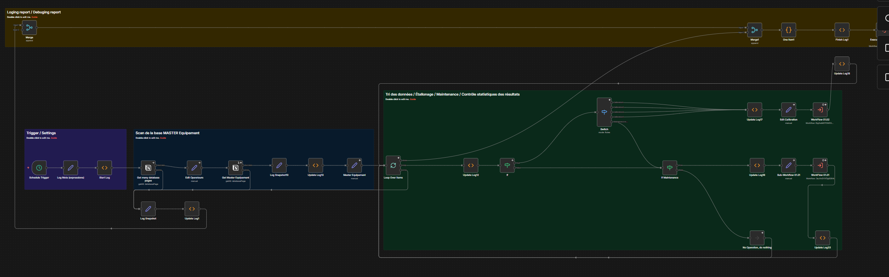</td>
  </tr>
  <tr>
    <td align="center"><b>Espace personnel des tâches en cours</b></td>
    <td align="center"><b>Architecture — gouvernance</b></td>
  </tr>
  <tr>
    <td align="center">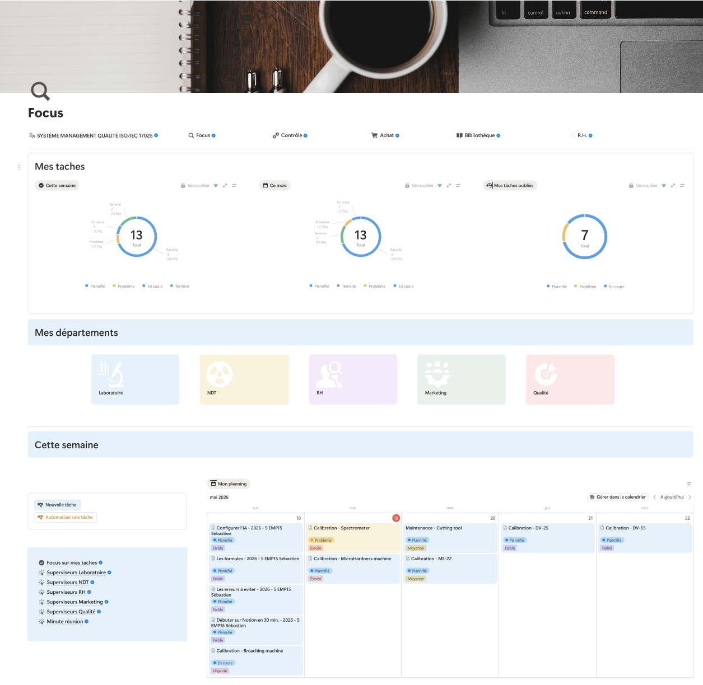</td>
    <td align="center"></td>
  </tr>
  <tr>
    <td align="center"><b>Workflow n8n — Génération et distribution des tâches complexes avec attribution RACI</b> (60 nœuds)</td>
    <td align="center"><b>Workflow n8n — Auto-maintenance des données et archivage ciblé</b> (44 nœuds)</td>
  </tr>
  <tr>
    <td align="center">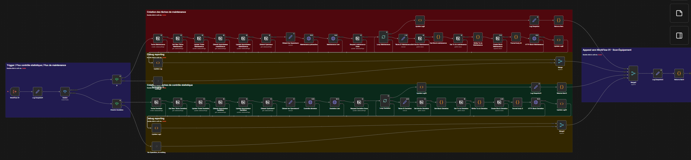</td>
    <td align="center">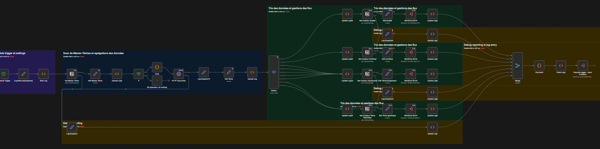</td>
  </tr>
</table>

## Compétences démontrées

- Modélisation de bases de données relationnelles (Notion : relations, rollups, formules).
- Automatisation événementielle et planifiée (n8n : scans, webhooks, sous-workflows, logs).
- Architecture de système d'information autour d'une table de faits centrale.
- Documentation produit reproductible.
- Logique SMQ ISO/IEC 17025 (traçabilité, maîtrise documentaire, métrologie, compétences).
- UX différenciée par rôle (espaces communs / gestionnaires / personnels).
- Conception de parcours de formation (trousses par type de poste, onboarding, formation continue).
- Intégration d'agents IA conversationnels respectant les autorisations.

## Analyse de valeur (business case)

Au-delà de la construction, le projet a fait l'objet d'un **dossier de valeur** — enjeux, risques et retour sur investissement projeté (détail : [docs/07-analyse-valeur.md](docs/07-analyse-valeur.md)).

**ROI projeté** — valorisation du temps gagné par siège (1 h/semaine × 45 semaines × taux horaire) face au coût d'abonnement Notion :

| Scénario de déploiement | Coût annuel | Gain projeté (1–2 h/sem) | Retour |
|---|---|---|---|
| Superviseurs & responsables *(recommandé au lancement)* | ≈ 2 950 $ CAD | ≈ 12 150 – 24 300 $ CAD | ≈ 4× à 8× |
| Tout le personnel | ≈ 5 515 $ CAD | ≈ 21 600 – 43 200 $ CAD | ≈ 4× à 8× |

*Chiffres prévisionnels (projection de décision, pas un résultat mesuré). Taux horaires illustratifs par rôle, sans donnée de paie réelle.*

**Risques principaux et mitigations :** analytique directionnelle limitée → pont BI (n8n → Power BI) ; dépendance Notion → intégrations + plan de sortie ; charge de la base centrale → archivage automatisé (WF 05) ; turnover → documentation vivante + relais internes formés.

## Limites assumées

- **Analytique plafonnée par Notion** : plusieurs indicateurs sont des formules de type texte, non agrégeables nativement — pas de SQL ; un pont BI externe serait nécessaire pour des dashboards quantitatifs.
- **Dépendance** à la disponibilité de Notion et de n8n.
- **Gaps ISO 17025 identifiés** : §7.10 (travail non conforme), §8.7 (actions correctives), §8.5 (registre de risques formel) ne sont pas formalisés à ce jour. Voir [docs/04-iso-17025-mapping.md](docs/04-iso-17025-mapping.md).
- **Dette technique documentée** : conventions de nommage hétérogènes, 4 bases d'archives quasi identiques, catalogues méta non synchronisés automatiquement.

## Structure du dépôt

```
notion-qms-lab/
├── README.md
├── LICENSE
├── docs/                  Documentation détaillée (architecture, workflows, processus, ISO, RH, agents, analyse de valeur)
├── diagrams/              6 diagrammes Mermaid (.mmd) autonomes
├── screenshots/           Captures renommées + MANIFEST.md (inventaire, catégories, anonymisation)
├── exports/workflows/     25 workflows n8n exportés et anonymisés + README d'index
├── ANONYMIZE-TODO.md      Démarche d'anonymisation : périmètre et check-list
└── ANONYMIZE-ADDENDUM.md  Démarche d'anonymisation : éléments traités hors périmètre initial
```

## Documentation

- [docs/01-architecture-back-end.md](docs/01-architecture-back-end.md) — les 9 hubs, Master Tâches comme table de faits, le pivot RACI, le méta-référentiel.
- [docs/02-workflows-n8n.md](docs/02-workflows-n8n.md) — les 16 workflows et sous-workflows, déclencheurs et bases impactées (source : JSON).
- [docs/03-processus-cles.md](docs/03-processus-cles.md) — les 6 processus métier de bout en bout.
- [docs/04-iso-17025-mapping.md](docs/04-iso-17025-mapping.md) — correspondance avec ISO/IEC 17025:2017 et gaps assumés.
- [docs/05-formation-rh.md](docs/05-formation-rh.md) — le sous-système Formation et Onboarding RH.
- [docs/06-agents-ia.md](docs/06-agents-ia.md) — les agents Notion AI intégrés.
- [docs/07-analyse-valeur.md](docs/07-analyse-valeur.md) — enjeux, risques, opportunités et ROI projeté (business case).

---
*Dépôt dérivé d'un projet réel : œuvre anonymisée et reformulée. La démarche d'anonymisation (noms, fournisseurs, données financières, identifiants et credentials) est documentée dans [`ANONYMIZE-TODO.md`](ANONYMIZE-TODO.md) et [`ANONYMIZE-ADDENDUM.md`](ANONYMIZE-ADDENDUM.md).*

*Notion® et n8n™ sont des marques de leurs détenteurs respectifs (Notion Labs, Inc. et n8n GmbH). Ce projet est indépendant et n'est ni affilié à, ni approuvé par ces sociétés ; leurs logos ne sont utilisés qu'à titre d'indication des technologies employées.*
