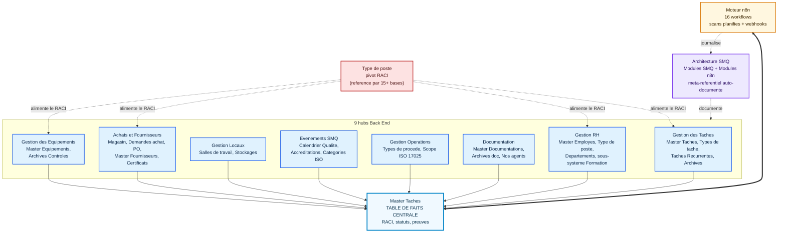

# Architecture Back End

## Vue d'ensemble

Le Back End est la couche de données du système : 38 bases Notion interconnectées, regroupées en 9 hubs métier et cartographiées comme 30 modules fonctionnels reliés par 62 liens directionnels dans la méta-base *Modules SMQ*. Le Front End (6 menus : SMQ, Focus, Contrôle, Achat, Bibliothèque, RH) n'est qu'un ensemble de vues filtrées posées sur ces bases ; toute la logique relationnelle, les rollups, les formules et les déclencheurs vivent dans le Back End.

Le choix structurant est l'inversion habituelle : plutôt qu'une base par domaine fonctionnant en silo, le système fait **converger toutes les actions vers une table de faits unique — *Master Tâches*** — et délègue la circulation de la donnée entre domaines à n8n. Ce parti pris est ce qui rend le système maintenable par une PME sans équipe SI dédiée.

> **Infrastructure d'automatisation.** n8n est auto-hébergé sur un serveur Hostinger (VPS). La mise en production implique la configuration du serveur, la gestion des mises à jour de n8n, et l'exposition sécurisée des webhooks entrants. Cette couche d'infrastructure est gérée de manière autonome.

## Schéma d'architecture

Source du diagramme : [diagrams/back-end-architecture.mmd](../diagrams/back-end-architecture.mmd).

## Les 9 hubs et leur rôle

| Hub Back End | Rôle | Bases / modules clés | Lien avec l'objectif |
|---|---|---|---|
| Gestion des Tâches | Pilotage RACI unifié de toutes les actions | Master Tâches, Types de tâche, Tâches Récurrentes, Archives des Tâches, Archives n8n Logs | Cœur opérationnel : centralise exécution et preuves |
| Gestion des Équipements | Maintenance, étalonnage, contrôle de dérive, quarantaine | Master Equipements, Archives Contrôles des Équipements | Conformité métrologique ISO 17025 |
| Achats & Fournisseurs | Cycle DA vers PO vers Réception vers Magasin | Magasin, Demandes d'achat, Bons de Commande (PO), Master Fournisseurs, Certificats Fournisseurs, Types de consommables / services | Traçabilité financière et certificats fournisseurs |
| Gestion Locaux | Référentiel 5S des espaces de travail | Salles de travail, Stockages | Cadre physique des opérations |
| Évènements SMQ | Calendrier qualité ISO 17025 | Calendrier Qualité, Accréditations, Catégories ISO 17025, Archives Qualité | Pilotage du cycle d'accréditation |
| Gestion Opérations | Définition du scope technique accrédité | Types de procédé, Scope ISO 17025 | Périmètre métier et normatif |
| Documentation | Source unique contrôlée, versionnée, archivée | Master Documentations Entreprise, Archive Documentations, Nos agents | Maîtrise documentaire ISO 17025 |
| Gestion RH | Structure RACI + parcours de formation par type de poste | Master Employés, Type de poste, Niveaux Hiérarchiques, Départements, Nos Formations, Modules-Formations, Instances, Inscriptions | Alimente le RACI et industrialise la montée en compétences |
| Architecture SMQ | Méta-référentiel d'auto-documentation | Modules SMQ, Modules n8n | Garantit la maintenabilité du système |

Justification, hub par hub, des décisions visibles dans le schéma des bases :

- **Gestion des Tâches.** Le hub n'expose pas une base par type d'action (maintenance, achat, formation, audit) mais une seule *Master Tâches* alimentée par tous les domaines. On a accepté un schéma plus large (≈ 25 propriétés, dont plusieurs rollups RACI) en échange d'un point unique de pilotage et de preuve. La contrepartie est une charge sur la base centrale, anticipée et traitée par l'archivage WF 05.
- **Gestion des Équipements.** *Master Equipements* porte trois sous-systèmes parallèles — étalonnage, maintenance, contrôle de déviation — chacun avec son couple `Dernier / Prochain`, ses formules de progression et son `... Request` (marqueur n8n). C'est volontairement redondant : chaque axe métrologique a son propre échéancier indépendant. Le coût est une base très large (45+ propriétés) et des conventions de nommage à surveiller (`Étalloné par`, `Intervale`, `Progession` — fautes consignées dans l'audit).
- **Achats & Fournisseurs.** Le hub sépare le besoin (*Demandes d'achat*) de la commande (*Bons de Commande*) avec une relation bidirectionnelle DA ↔ PO, ce qui permet de regrouper plusieurs DA dans un PO par fournisseur. Le choix d'un préfixage `🔴` (lecture seule) / `🟡` (saisi) sur *Demandes d'achat* documente la provenance de chaque champ directement dans son nom — pratique pour l'opérateur, fragile pour les exports.
- **Gestion Locaux.** Deux bases minces (*Salles de travail*, *Stockages*) servent de référentiel physique rattaché aux équipements. Le lien `Événements gestions des locaux` pointe vers une base hors périmètre cartographié — signalé comme point à clarifier.
- **Évènements SMQ.** *Calendrier Qualité* est la source planifiée des jalons d'accréditation ; il est lu par WF 04 pour produire des tâches. *Accréditations* est un pivot normatif transverse (5 bases pointent vers lui).
- **Gestion Opérations.** *Scope ISO 17025* et *Types de procédé* relient procédés, normes (`Norme` vers *Master Documentations*), équipements et personnel — c'est la déclaration du périmètre technique, distincte de la portée officielle d'accréditation.
- **Documentation.** *Master Documentations Entreprise* est le pivot documentaire (versionnage via bouton *Nouvelle Version* / WF 11). Trois axes de classification non orthogonaux (`Documents` × `Type` × `Type Code`) cohabitent — richesse utile au tri, complexité à maîtriser.
- **Gestion RH.** Au-delà de l'annuaire, le hub porte un sous-système Formation complet (4 bases) détaillé dans [docs/05-formation-rh.md](05-formation-rh.md).
- **Architecture SMQ.** Hub méta : il documente le système lui-même (cf. dernière section).

## Master Tâches — table de faits centrale

Toutes les actions de l'entreprise — qu'elles soient générées par un scan n8n (WF 01-04), poussées par un bouton (formation, achat) ou créées à la main via formulaire — atterrissent dans *Master Tâches*. La base est construite sur une matrice **RACI** explicite :

- **Créateur** (`created_by`) — Consulté / Informé.
- **Responsable** (relation vers *Type de poste*, exposé via les rollups `Nom Responsable` / `ID Responsable`) — Responsable.
- **Équipe** (relation vers *Type de poste*, rollups `ID Équipes` / `Participants`) — Consulté / Informé.
- **Approbateur** (`person`) — Approbateur.
- **Personnel Ressource** (`person`) — Consulté.

Le pattern de bout en bout est : **objet source → tâche → archivage**. Un équipement dont l'étalonnage arrive à échéance, un certificat qui périme, un jalon du calendrier qualité ou une inscription de formation produisent tous une tâche RACI dans la même table, exécutée selon le même cycle, puis archivée par le même mécanisme.

Pourquoi une table unique plutôt qu'une table par domaine ? Trois raisons techniques :

1. **Un seul cycle de vie à maintenir.** Statuts, vérification, échéances, preuves et logique d'archivage sont définis une fois, pas répliqués dans cinq bases. Toute évolution du cycle (un nouveau statut, une règle d'approbation) se fait au même endroit.
2. **Une seule surface d'intégration pour n8n.** Les scans écrivent dans *Master Tâches* ; le webhook de clôture WF 06 lit *Master Tâches*. n8n n'a pas à connaître la topologie complète du Back End, seulement la table de faits et l'objet source concerné.
3. **Une traçabilité homogène.** Pour un audit ISO 17025, retrouver « toutes les actions et leurs preuves » revient à interroger une table, pas à réconcilier des schémas hétérogènes.

La contrepartie assumée : *Master Tâches* grossit vite et concentre la charge. Le système l'a anticipé avec deux mécanismes — le marqueur `Anti-Spam` (empêche n8n de recréer une tâche déjà générée) et l'archivage WF 05, qui déplace les tâches clôturées vers des archives thématiques et conserve l'historique 5 ans. C'est l'allègement structurel le plus visible de l'architecture.

> Point de vigilance hérité du Back End réel : la propriété est nommée `Date de créeation` (un « e » en trop). Conservé tel quel ici car c'est l'état documenté ; à corriger côté Notion car cela fragilise filtres et exports.

## Le pivot RACI — Type de poste

La matrice RACI ne référence presque jamais une personne directement : elle pointe vers ***Type de poste***. Plus de quinze bases (Master Tâches, Tâches Récurrentes, Calendrier Qualité, Magasin, Master Fournisseurs, Master Documentations, Master Equipements ×4, Demandes d'achat, les archives de tâches, Scope ISO 17025, Types de procédé, Salles de travail, Modules-Formations) résolvent leurs responsables via ce pivot, qui remonte ensuite la personne par rollup (`Type de poste → Master Employés → Utilisateur`).

Le bénéfice : un changement de titulaire de poste se propage partout sans toucher les tâches existantes ; la responsabilité est exprimée par rôle, pas par individu. La limite, relevée par l'audit : *Scope ISO 17025* utilise une convention concurrente (`Personnel spécialisé` pointe directement vers *Master Employés*), et *Type de poste* expose à la fois un rollup `Utilisateurs` et un champ `ID_Utilisateur` (person) — deux chemins vers la personne, à désambiguïser pour éviter la désynchronisation.

## Relations entre bases — comment la donnée circule

La donnée circule par trois mécanismes Notion, sans base de calcul intermédiaire :

- **Relations** (souvent bidirectionnelles) — matérialisent les liens métier : DA ↔ PO, Équipement ↔ Fournisseur (`Étalloné par`), Module-Formation → Type de poste.
- **Rollups** — remontent l'information le long des relations sans la dupliquer : `Nom Responsable` via `Responsable → Master Employés`, `Prix Total $` via `Répondant → Inscriptions`.
- **Formules** — produisent les indicateurs visuels et les statuts dérivés : `En retard` (Master Tâches), barres de progression d'étalonnage, `À jours` (Documentation).

Deux pivots structurent le graphe au-delà de *Type de poste* : *Master Documentations Entreprise* (pivot documentaire, relié à Types de procédé, Accréditations, Scope, Modules-Formations, Inscriptions) et *Accréditations* (pivot normatif, 5 bases entrantes). Limite native reconnue : plusieurs indicateurs financiers ou de progression sont des **formules de type texte** (`🔴Coût total ($)`, `Progressions`, `Contrôle Certificat`) et non des nombres — ce qui empêche toute agrégation (somme, moyenne) côté Notion et plafonne l'analytique. C'est la principale dette technique à connaître avant de promettre des tableaux de bord quantitatifs.

## Méta-référentiel Architecture SMQ

Le hub *Architecture SMQ* documente le système avec le système lui-même : *Modules SMQ* recense chaque module fonctionnel et ses dépendances (30 modules, 62 liens), *Modules n8n* recense les workflows, leurs sous-workflows, déclencheurs et fréquences. Les deux bases sont reliées (`WorkFlow n8n` ↔ `Log Impacté`), ce qui crée une carte interrogeable de l'architecture.

Valeur pour la maintenabilité : un repreneur peut comprendre la topologie sans rétro-ingénierie. Limite assumée : ces bases reposent sur des catalogues `multi_select` descriptifs (Vue, Automatisation, Webhook, Buttons, Formulaire) **non synchronisés automatiquement** avec les bases réelles — d'où un risque de dérive entre la documentation et l'implémentation, et la nécessité d'une revue périodique. À noter aussi : *Modules n8n* documente WF 01 à 11 alors que le catalogue `Workflow` d'*Archives - n8n Logs* s'arrête à WF 06 — incohérence à corriger.

## Captures

Captures de référence pour ce document (voir [screenshots/MANIFEST.md](../screenshots/MANIFEST.md)) :

- `front-end_systeme-management-qualite-iso-iec.png` — page d'accueil de la plateforme QMS (entrée du Front End).
- `back-end_exemple-d-une-base-de.png` — exemple d'une base de données structurée du Back End.
- `architecture_governance-flowchart.png` — vue d'ensemble de la gouvernance (Master Tâches au centre, n8n en moteur).
- `architecture_base-de-donnees-du-suivis.png` — *Modules SMQ* (suivi des bases Notion).
- `architecture_base-de-donnees-des-suivis.png` — *Modules n8n* (suivi des workflows).
- `architecture_base-de-donnee-des-logs.png` — base *Archives - n8n Logs* (traçabilité d'exécution).

Le diagramme de référence : [diagrams/back-end-architecture.mmd](../diagrams/back-end-architecture.mmd).
